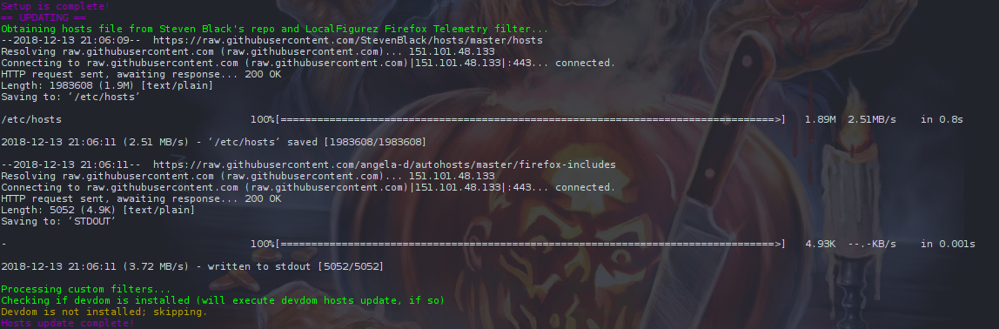
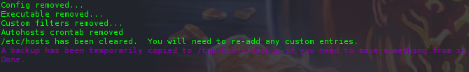

# Auto Update Ad-blocking Hosts file on Linux and Mac

Automate the hosts file process with cronjobs.

### Purpose of Hosts Files
Hosts files will reroute unwanted traffic from ad farms, behavioral tracking firms and malware sites to a blackhole; routing to 0.0.0.0 (localhost; your PC) when a request is made to a URL on the blacklist.

Which means any traffic that would have left your system for that destination, is sent inward, to your localhost and then abandoned.

Despite what some may suggest, hosts files are not "1980s technology" and still very useful today, as an additional *layer* of security.

Hosts file are a useful redundancy when coupled with ad blockers like [uBlock Origin](https://github.com/gorhill/uBlock) and [uMatrix](https://github.com/gorhill/uMatrix) - while debugging or 'Temporarily Allow All on this Site' with [Noscript](https://noscript.net/) can open you up to underlying attacks or privacy intrusions.

In-browser filters won't protect you if the browser itself is phoning home.

If you have an up-to-date hosts file, the risk is severely lessened.

**Auto Hosts** will automate the setup process for maintaining an up to date hosts file, by:
 - Installing a weekly cronjob to pull fresh/updated copies of [Steven Black's Host file](https://github.com/StevenBlack/hosts) and [LocalFigurez Firefox Telemetry List](https://github.com/angela-d/autohosts/blob/master/firefox-includes) (default is every Sunday at 7:22pm)
 - Appends Facebook trackers, Linkedin ads, Google fonts, Firefox telemetry and other harvester sites that curated lists for whatever reason, have not added to their blacklists
 - Refreshes DNS to instantiate the re-routed changes (Mac Only)
 - If [Devdom](https://notabug.org/angela/devdom) is installed, append all local virtualhosts
 - Uninstall offers the ability to revert to a fresh hosts file and undo any changes made by Autohosts; a backup will be copied to /tmp
 - Add custom filters from ~/autohosts on your desktop

Installing:


### Firefox Snooping list by LocalFigurez added in v1.1.0
For those of us who want our browser to behave like a browser and not a GPS anklet, this list will prove useful by blocking a [plethora of tracking URLs](firefox-includes).  A few of which, some Firefox users have noticed seem to phone home even when the setting is toggled off in about:config.

### Custom filters added in v1.3.0
You can easily append any domain you want to blacklist directly from your home directory.  Your custom preferences will be stored with each subsequent update - set it and forget it!

## To Install
```bash
git clone https://github.com/angela-d/autohosts.git && cd autohosts && sudo ./autohosts
```

***
## To upgrade an existing install
To see which version you're running on your system: `grep "VERSION=" /usr/local/bin/autohosts`

v1.3.1 - present
- No core changes; Autohosts will update the filters on your schedule; modification to the repo isn't necessary, unless you want any of the [minor changes](releases).  You can confirm it's latest date of update by running: `grep "# Date:" /etc/hosts`

v1.3.0:
- A fresh install of Autohosts is recommended, due to the functional changes of custom filters

v1.1.0:
 - You do not need to uninstall the prior version
 - Simply re-run Autohosts:
 ```bash
 git clone https://github.com/angela-d/autohosts.git /tmp && cd autohosts ./autohosts
 ```

Versions prior to 1.1.0:

- Clone the repo to /tmp:
```bash
git clone https://github.com/angela-d/autohosts.git /tmp && cd autohosts ./uninstall-autohosts
```
Then:
```bash
./autohosts
```


The script will take care of the rest!

***

## Adding custom filters
Custom filters are loaded to your home directory:

**Linux:**

`~/autohosts/custom_filters` or `/home/your_username/autohosts/custom_filters`


**MacOS**

`~/autohosts/custom_filters` or `/Users/your_username/autohosts/custom_filters`
- This file can be edited in your favorite text editor; command-line modifications are not necessary!

### Adjust the cron time
If your computer is not powered on when the cron is scheduled, you'll miss the update.  Ensure the cronjob is set for a time when you're most likely to have it on.  You can adjust it by running:
```bash
crontab -e
```
and modifying the dates to suit.

Cron legend:
```html
* * * * * = minute, hour, day of month, month, day of week (0 = Sunday, 6 = Saturday)
```
(`*` = *every*, so 5 straight stars is equal to every minute of every hour of every day and every month.. which you should never run while pulling 3rd party content!)

Uninstalling:


**Note:** Because this script has to modify `/etc/hosts` - it needs elevated privileges (running as root or a sudo user).  Scripts that require elevated privilenges should be read an analyzed so you know what's being done to your system!  Read the source code of this script (and any others requiring such permissions) before you install.

### Alternative uses with Hosts files
- If you're running DD-WRT, you can add a cron to pull a [hosts file for your entire network](https://github.com/angela-d/brain-dump/blob/master/networking/dd-wrt.md) or load [Pi-Hole](https://pi-hole.net/) to a Raspberry Pi.
